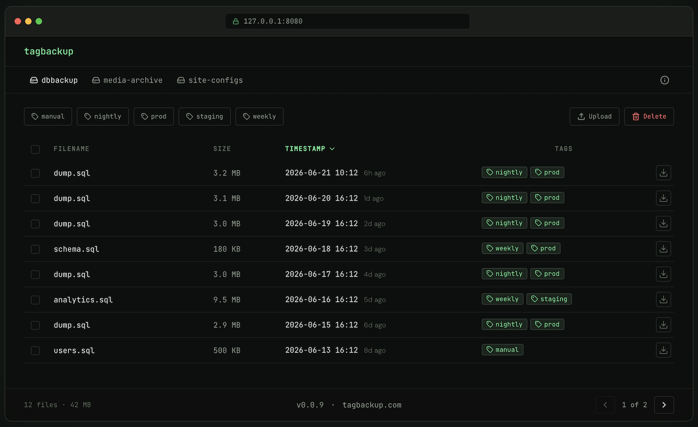

<div align="center">

# tagbackup

**Backup files to S3-compatible buckets with human-readable tags.**

Upload, download, list, and delete files — identified and filtered by simple tags. Now with a local web UI.

[](https://github.com/joncombe/tagbackup/releases)
[](LICENSE)
[](https://go.dev/)

</div>

<div align="center">
  
</div>

<div align="center">

[Website](https://tagbackup.com/) · [Documentation](https://tagbackup.com/docs/) · [Releases](https://github.com/joncombe/tagbackup/releases) · [Motivation](https://www.joncom.be/projects/tagbackup/)

</div>

## About

tagbackup is a single-binary CLI tool that uploads, downloads, lists, and deletes files on any S3-compatible bucket — with files identified and filtered by simple human-readable tags baked directly into the object key. No external index. No database. No telemetry.

Tags travel with the file, not beside it. Combine them with `AND`, `OR`, and `NOT` expressions to pull exactly the files you need.

---

## Demo

```
$ tagbackup push dump.sql --bucket=dbbackup --tag=nightly,prod
✓ Uploaded 1776831788343-nightly,prod-dump.sql

$ tagbackup files --bucket=dbbackup --tag=nightly
TIMESTAMP                 SIZE     FILENAME  TAGS
2026-06-13 22:34:01Z    1.2 MiB   dump.sql  [nightly, prod]
2026-06-08 22:34:01Z    1.1 MiB   dump.sql  [nightly, prod]

$ tagbackup pull --bucket=dbbackup --tag=nightly+prod --latest
✓ Downloaded dump.sql
```

Run `tagbackup serve` to get a local web UI for browsing, filtering, uploading, and deleting — bound to `127.0.0.1` only.

---

## Installation

**Linux / macOS (one-liner):**

```sh
curl -sfL https://tagbackup.com/install.sh | sh
```

**Or download a binary directly from [GitHub Releases](https://github.com/joncombe/tagbackup/releases):**

| Platform            | Asset                             |
| ------------------- | --------------------------------- |
| Linux x86_64        | `tagbackup_*_linux_amd64.tar.gz`  |
| Linux ARM64         | `tagbackup_*_linux_arm64.tar.gz`  |
| macOS Intel         | `tagbackup_*_darwin_amd64.tar.gz` |
| macOS Apple Silicon | `tagbackup_*_darwin_arm64.tar.gz` |
| Windows x86_64      | `tagbackup_*_windows_amd64.zip`   |

Extract the archive, make the binary executable, and move it onto your `PATH`. See the [documentation](https://tagbackup.com/docs/) for more detail.

---

## Quick Start

```sh
# 1. Add a bucket (interactive setup)
tagbackup bucket add

# 2. Push a file with tags
tagbackup push dump.sql --bucket=dbbackup --tag=nightly,prod

# 3. List files by tag
tagbackup files --bucket=dbbackup --tag=prod

# 4. Pull the latest matching file
tagbackup pull --bucket=dbbackup --tag=nightly+prod --latest
```

See the [documentation](https://tagbackup.com/docs/) for all flags and options.

---

## Commands

| Command         | What it does                                                   |
| --------------- | -------------------------------------------------------------- |
| `push`          | Upload a file with one or more tags                            |
| `pull`          | Download the latest (or chosen) file matching a tag expression |
| `files`         | List all objects matching a tag expression                     |
| `tags`          | List all tags in use across a bucket with counts and dates     |
| `delete`        | Delete objects by tag, with `--older-than` for retention       |
| `serve`         | Start a local web UI for visual browsing and management        |
| `bucket add`    | Configure a new S3-compatible bucket alias                     |
| `bucket verify` | Test connectivity and permissions against a bucket             |

---

## Features

- **Tag-based organisation** — tags are embedded in the S3 object key; filter with `AND` / `OR` / `NOT` expressions, no external index needed.
- **Any S3-compatible store** — works with AWS S3, Cloudflare R2, MinIO, Backblaze B2, and any provider that speaks the S3 API.
- **Local web UI** — run `tagbackup serve` to browse and manage buckets from your browser; binds to `127.0.0.1` only.
- **Scriptable** — non-interactive mode, JSON output (`--json`), and meaningful exit codes make it easy to use in cron jobs and shell scripts.
- **Flexible credentials** — static keys, AWS profiles, IAM roles, or environment variables; resolution order is predictable and documented.
- **Atomic downloads** — writes to a temp file and renames on success; an interrupted download never leaves a partial file.
- **No telemetry** — all API calls go directly between tagbackup and your bucket; nothing dials home.

---

## Tag Expressions

Used with `pull`, `files`, and `delete` via the `--tag` flag.

| Token  | Meaning                        |
| ------ | ------------------------------ |
| `a\|b` | OR — files with tag `a` or `b` |
| `a+b`  | AND — files with both tags     |
| `-a`   | NOT — files without tag `a`    |
| `(…)`  | Grouping, evaluated first      |

```sh
tagbackup files --bucket=mybackup --tag=prod             # tagged prod
tagbackup files --bucket=mybackup --tag=db+prod          # both db and prod
tagbackup delete --bucket=mybackup --tag=nightly+prod --older-than=30d --force
```

---

## Classic Use Case

> Cron pushes it nightly. Your laptop pulls the latest whenever you need it.

```sh
# On the server (cron)
pg_dump mydb | tagbackup push - --bucket=db --tag=nightly,prod --filename=dump.sql
tagbackup delete --bucket=db --tag=nightly+prod --older-than=30d --force

# On your laptop
tagbackup pull --bucket=db --tag=nightly+prod --latest
```

---

## Contributing

Contributions, bug reports, and feature requests are welcome. Please [open an issue](https://github.com/joncombe/tagbackup/issues) or submit a pull request.

---

## License

[MIT](LICENSE) · [tagbackup.com](https://tagbackup.com/)
